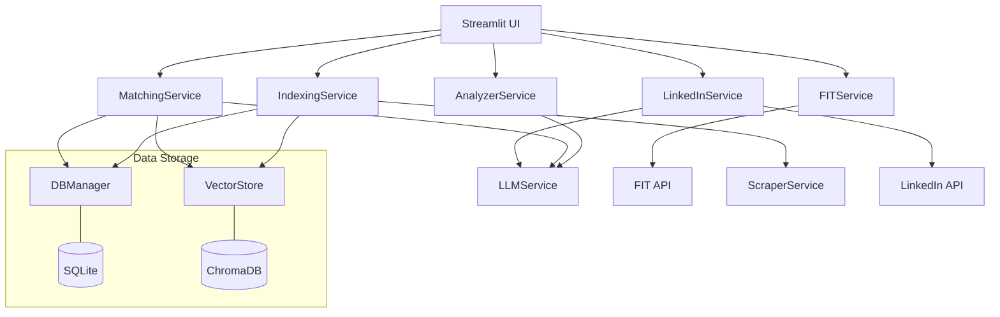
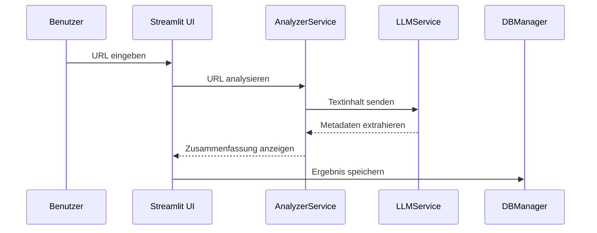

# Architektur

Die Förderrecherche App ist eine modulare Streamlit-Anwendung, die verschiedene spezialisierte Dienste nutzt.

## Systemübersicht

Die App basiert auf einer serviceorientierten Architektur. Die Benutzeroberfläche (`app/main.py`) fungiert als zentraler Orchestrator und ruft die entsprechenden Dienste auf.

## Datenfluss

Der typische Datenfluss bei einer Ausschreibungsanalyse sieht wie folgt aus:

## Kernkomponenten

### Dienste (`app/services/`)  
- **AnalyzerService**: Extraktion strukturierter Daten aus Ausschreibungen.  
- **FITService**: Schnittstelle zur Forschungsdatenbank der Uni Kassel.  
- **IndexingService**: Crawling und Indexierung von Webseiten.  
- **LinkedInService**: Kontaktmanagement und Outreach.  
- **LLMService**: Abstraktionsschicht für verschiedene LLM-Anbieter.  
- **MatchingService**: Durchführung der Hybrid-Suche.  
- **ScraperService**: Abrufen und Bereinigen von Webinhalten.  

### Hilfsprogramme (`app/utils/`)  
- **DBManager**: Verwaltung der SQLite-Datenbank.  
- **VectorStore**: Verwaltung der ChromaDB-Vektordatenbank.  
- **Translations**: Unterstützung für Mehrsprachigkeit.  
- **GeoUtils**: Geokodierung von Firmenstandorten.  
