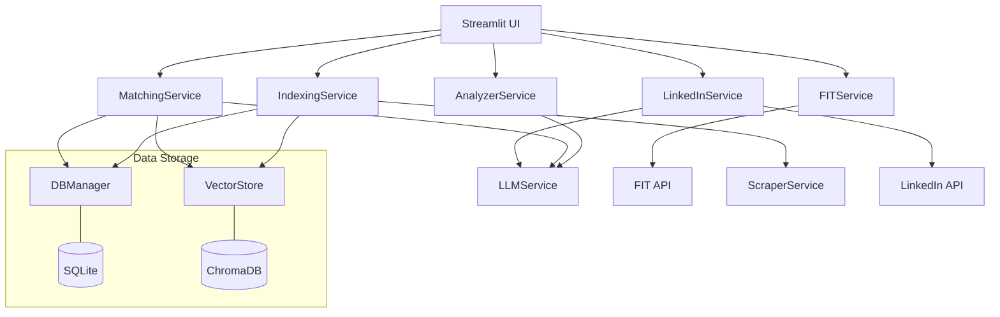
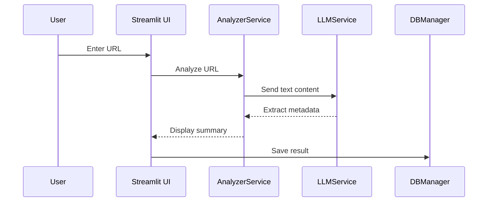

# Architecture

The Funding Research App is a modular Streamlit application that utilizes various specialized services.

## System Overview

The app is based on a service-oriented architecture. The user interface (`app/main.py`) acts as the central orchestrator and calls the corresponding services.

## Data Flow

The typical data flow for a call analysis looks like this:

## Core Components

### Services (`app/services/`)  
- **AnalyzerService**: Extraction of structured data from research calls.  
- **FITService**: Interface to the University of Kassel research database.  
- **IndexingService**: Crawling and indexing of websites.  
- **LinkedInService**: Contact management and outreach.  
- **LLMService**: Abstraction layer for various LLM providers.  
- **MatchingService**: Performing hybrid searches.  
- **ScraperService**: Fetching and cleaning web content.  

### Utilities (`app/utils/`)  
- **DBManager**: Management of the SQLite database.  
- **VectorStore**: Management of the ChromaDB vector database.  
- **Translations**: Support for multi-language support.  
- **GeoUtils**: Geocoding of company locations.  
